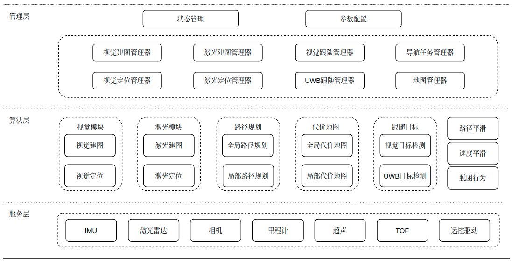
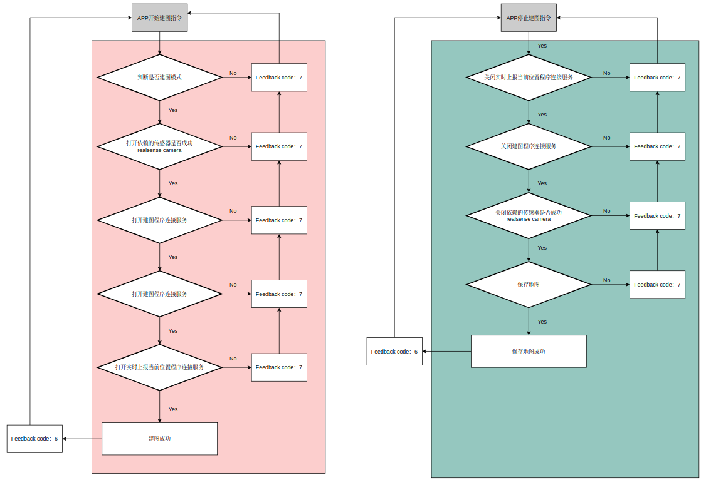
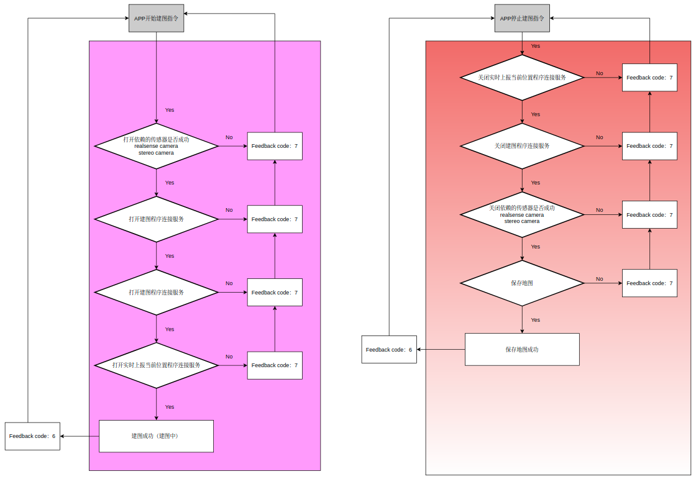
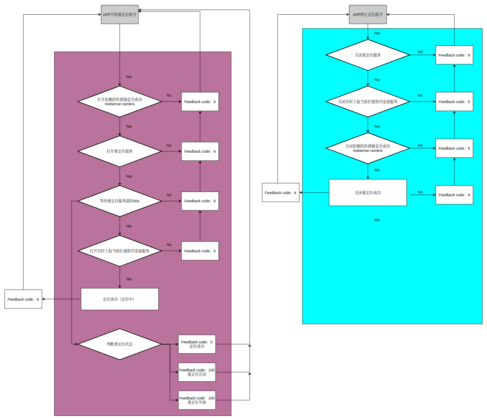
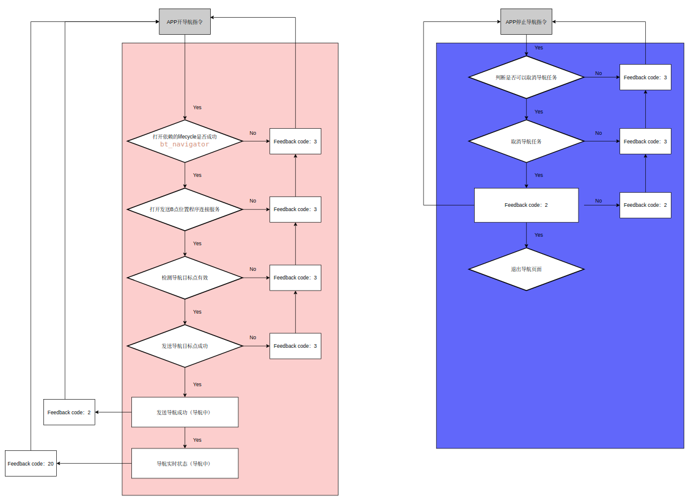
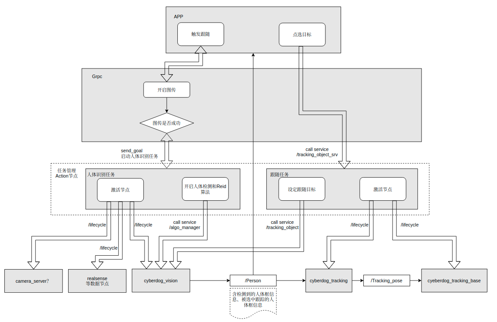
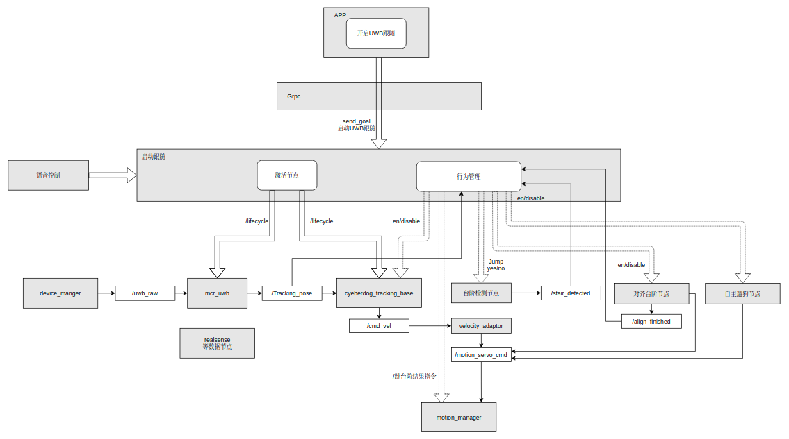

# 算法任务管理设计文档

## 概述
算法任务管理模块是对系统中与自主行走能力有关的任务指令的集中管理模块，包括建图、定位、导航、跟随等算法任务。该模块根据系统整体状态机、任务执行状态等，对用户的任务指令进行决策，并根据确定的任务类型，管理系统中的硬件、软件资源。
## 模块架构

### 架构说明

- 接口以ros action的形式提供。

- 任务状态以独占形式进行管理，即当前如果有任务在执行时，新的任务指令将返回reject状态。同时停止任务指令也必须当前的任务状态对应，否则将返回停止失败，例如在执行建图任务时，调用方如果下发了停止导航的指令，将返回失败状态。 

- 算法任务包含了视觉建图、视觉定位、激光建图、激光定位、AB点导航、视觉跟随、UWB跟随任务。算法管理层负责启动相关的依赖节点、请求相关的服务，在停止任务时同时关闭相关的依赖节点和关闭相关的服务。

## 任务管理流程

### 1 激光建图

步骤：

- step 1： 判断建图模式

- step 2： 打开realsense传感器

- step 3： 通知建图服务程开始建图

- step 4： 判断是否实时上报机器人当前位置

- step 5： 开始建图

### 2 视觉建图

步骤：

- step 1： 判断建图模式

- step 2： 打开realsense传感器、双目传感器

- step 3： 通知建图服务程开始建图

- step 4： 判断是否实时上报机器人当前位置

- step 5： 开始建图

### 3 激光重定位

步骤：

- step 1： 判断打开realsense传感器

- step 2： 通知重定位服务程开始重定位功能

- step 3： 等待结果是否超时，超时直接退出定位，否者等待定位结果

- step 4： 判断重定位状态， 0成功， 100重试和1200失败

- step 5： 定位成功

### 4 视觉重定位

步骤：

- step 1： 判断打开realsense传感器、双目传感器

- step 2： 通知重定位服务程开始重定位功能

- step 3： 等待结果是否超时，超时直接退出定位，否者等待定位结果

- step 4： 判断重定位状态， 0成功， 100重试和1200失败

- step 5： 定位成功

### 5 AB点导航

步骤：

- step 1： 判断打开bt_navigator

- step 2： 接受导航点B点位置，判断导航点有效性

- step 3： 发送开始AB导航

- step 4： 实时上报导航状态

- step 5： 导航成功

### 6 视觉跟随

视觉跟流程图

- 视觉跟随功能由两个阶段组成：第一个阶段是启动视觉跟随功能，开始人体识别；第二阶段由用户选择需要跟随的目标，机器人开始自动跟随；

- 第一阶段的对上接口是一个action server，由GRPC下发视觉跟随启动命令；当收到启动视觉跟随的请求时，管理模块会对realsense和cyberdog_vision模块进行lifecycle管理，配置并激活相应模块；然后启动人体识别算法（由一个service client请求启动）；

- 之后等待用户选择需要跟随的目标；

- 第二阶段的对上接口是一个service server，通过GRPC下发跟随目标的roi；service server对roi信息进行透传，直接转发给视觉跟随模块（通过一个service client请求启动服务）；之后分别对cyberdog_tracking和cyberdog_tracking_base模块进行lifecycle管理，配置并激活相应模块；实现自动跟随。

### 7 UWB跟随

uwb跟随流程图

- uwb跟随功能中，首先需要用户在APP中实现了蓝牙遥控器（发送uwb数据）的配对，否则在启动时会提示uwb数据异常。

- 启动流程与视觉跟随相似，包含了启动相关的资源开启、依赖节点的激活等过程，区别在于不需要用户点选跟随的目标。

- uwb跟随中，在跟随目标静止时，狗可以表现出自主行为，相关的行为表现包含了执行指定的动作、播报语音、灯带效果的变化。

- 跟随中可以检测跟随路径上的台阶，在检测到台阶后，狗可以实现跳台阶的动作，跳上台阶后恢复跟随的步态。
