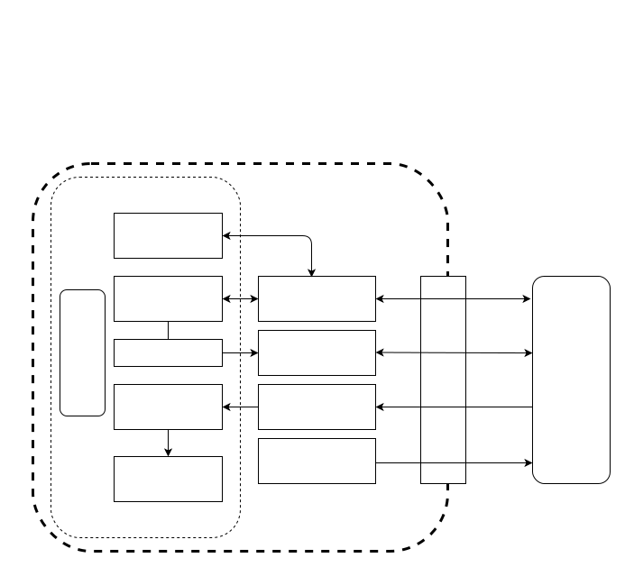

# 语音设计文档

## 概述

cyberdog_audio是nx端与r329端的语音业务中转站。例如，通过cyberdog_audio可以转发具体的播放离线语音、在线语音的请求。

## 设计

### 框架图

### 业务数据流



### 模块功能

cyberdog_audio具体模块设计

1. 基于LCM通讯的双向service与topic封装，实现了四个类：LcmAtocTopic、LcmCtoaTopic、LcmCtoaService、LcmAtocService。
   - LcmAtocTopic是R329发给NX的LCM消息处理封装类
   - LcmCtoaTopic封装了NX发往R329的LCM消息封装类
   - LcmCtoaService封装了NX请求R329的服务的LCM封装类。NX相当于客户端，R329相当服务端
   - LcmAtocService封装了R329请求NX的服务的LCM封装类。R329相当于客户端，NX相当服务端
2. 业务功能实现
   - 心跳维持
   - ```Bash
     NX以1次/s的心跳发送请求向R329确认其状态是否正常。如果心跳异常，会打印心跳异常日志。
     ```

   - 鉴权信息同步。
   - ```Bash
     (1)App端连接上狗子，会将账户的token信息通过透传到NX端，再同步到R329端。
     (2)由App端发起将token透传到NX端grpc节点，grpc节点通过调用cyberdog_audio的服务，在服务内部实现将token同步到R329端。
     (3)R329端拿到token信息，会做本地缓存。并用此token访问小爱云端服务。
     ```

   - 离线/在线语音播放
   - ```Bash
     (1)语音节点提供离线/在线语音播放topic与service两种方式。
     (2)离线语音，是指预至在nx端或者R329端的语音文件，通过id标识具体要播放的离线语音文件。可以参考“bridge/protocol/ros/msg/AudioPlay.msg”中定义的具体的离线语音id常量及关联的离线语音文件具体的播放文本内容。
     (3)在线语音，简称tts（text to speech）。是将文本转化为语音进行播放，需要NX端具有访问互联网的能力。
     ```

   - 控制垂域动作实现
   - ```Bash
     (1)控制垂域特指小爱服务端已配置的可以返回控制指令的能力。
     (2)R329在拿到token后，注册了小爱云端的访问能力。这样就能接收到小爱云端控制垂域的消息通知。
     (3)在喊“铁蛋铁蛋”唤醒狗子后，对着它说：“后退X步”、“原地转圈”、“击掌”、“过来”、“握个手”、“坐下”、“跳跃”、“摇尾巴”、“摇头”、“点头”、“鞠躬”、“芭蕾舞”、“太空步”，狗子会做相应的动作回应。
     ```

   - 音量设置获取及麦克风启用禁用
   - ```Bash
     (1)提供了音量大小设置服务。例：通过指令将音量设置为50， ros2 service call /`ros2 node list | grep "mi_" | head -n 1 | cut -f 2 -d "/"`/audio_volume_set protocol/srv/AudioVolumeSet "{volume: 50}"
     (2)提供了音量大小获取服务。例：通过指令获取当前音量值， ros2 service call /`ros2 node list | grep "mi_" | head -n 1 | cut -f 2 -d "/"`/audio_volume_get protocol/srv/AudioVolumeGet
     (3)提供了麦克风启用/禁用服务。麦克风禁用以后，不再进行收音，铁蛋不能被唤醒。
     ```

   - 设置昵称、录制声纹及声纹识别
   - ```Bash
     (1)狗子默认的昵称为铁蛋。在App端可以给狗子设置新的昵称，例如“旺财”。设置新的昵称为三个字及三个字以内，在唤醒时需要喊两次昵称才能唤醒，设置新的呢称多余三个字，直接喊昵称就能唤醒。需要注意的时，更换狗子的昵称后，可能导致误唤醒率提高。
     (2)App端提供了录制声纹的入口，绑定具体的主人信息。在进行录制声纹时，会触发录制声纹的流程。在声纹录制成功以后，喊“铁蛋铁蛋”唤醒狗子会进行声纹识别，然后问它：“我是谁？”，它能回答出你的姓名。
     ```

   - 狗信息上报
   - ```Bash
     (1)狗子信息主要包括：狗子昵称、狗子激活日期，狗子重量。
     (2)狗子在第一次激活后，会把狗子信息上报到云端。随着狗子成长，你问他几岁了，它会给出具体的回答。
     ```