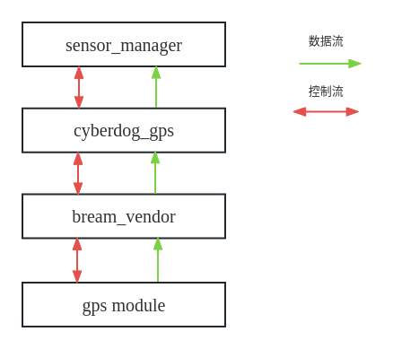
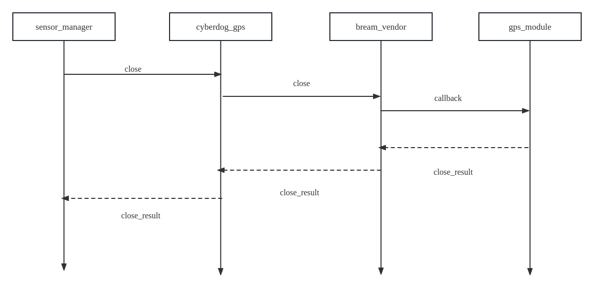

# Cyberdog_gps 设计文档

##  概述

``cyberdog_gps`` 以ros2 plugin形式向客户端提供gps数据服务，负责控制gps模组的起停，并将gps数据组织成ros msg格式通过sensor_manager向外发布。

## 软件设计

### 软件框架

 

#### 数据流开启

 
 

#### 数据流关闭

 

## 功能设计

 - 通过配置文件可gps功能相关配置参数等
 - 提供传感器开启、关闭、自检、仿真等基本能力接口

## 配置文件

- 源码路径：``bridges/params/toml_config/sensors``
- 安装路径：``/opt/ros2/cyberdog/share/params/toml_config/sensors``
- 配置文件：
  - ``bcmgps_config.toml``:用于配置gps相关参数
  - 主要的参数：
    - ``spi`` spi端口
    - ``patch_path`` patch路径
    - ``MsgRate`` gps数据频率

## API接口
  - ``Init(bool simulator)``：初始化配置
    - ``simulator = true``:配置为仿真模式
  - ``Open()``：打开传感器
  - ``Start()``：使能传感器
  - ``Stop()``：停止传感器
  - ``Close()``：关闭传感器
  - ``SelfCheck()``：传感器自检
  - ``LowPowerOn()``：进入低功耗模式
  - ``BCMGPS_Payload_callback(std::shared_ptr<GPS_Payload> payload)``：设置消息回调函数
