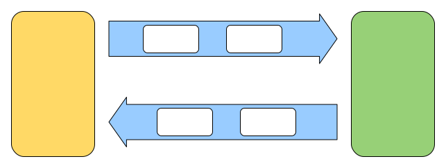

# cyberdog_grpc设计文档

## 概述

cyberdog_grpc是一个用于将ROS中的话题、服务、行动转化成gRPC请求的节点。它可以实现ROS与APP的通信。

## gRPC基本信息

gRPC是由 google开发的一个高性能、通用的开源RPC框架，主要面向移动应用开发且基于HTTP/2协议标准而设计，同时支持大多数流行的编程语言。

gRPC使用Protocol Buffers作为序列化协议，它是一种与语言、平台无关 、可扩展的序列化结构数据。它的定位类似于JSON、XML，但是比他们更小、更快、更简单。

## 开源仓库

https://github.com/grpc/grpc

### 版本

本产品中使用的是1.44.0，使用其它版本的gRPC也可以与本产品正常通信。

### 安装

C++可参考https://github.com/grpc/grpc/blob/master/BUILDING.md

Python: `pip3 install grpcio grpcio_tools`

其它语言可参考官方README.md

### 测试

编译测试例程：

```Shell
cd grpc/examples/cpp/helloworld
mkdir -p cmake/build
cd cmake/build
cmake ../..
make
```

运行服务器：

```Shell
./greeter_server
```

屏幕会显示：Server listening on 0.0.0.0:50051

运行客户端：

```Shell
./greeter_client
```

屏幕会显示：Greeter received: Hello world

## 接口设计

接口采用`nameCode + 内容`的形式进行远程调用。



### nameCode

即指令码，protobuf中类型为fixed32，C++中类型为uint32，对应着不同的调用功能，在本产品内部对应着不同的ROS接口。

### 内容序列化

多数的远程调用指令有调用参数以及返回的数据，这些内容都统一用符合JSON格式的字符串传输，本产品中采用[RapidJSON](https://github.com/Tencent/rapidjson)进行序列化和反序列化操作。

内容在protobuf中类型为string，C++中类型为std::string。

#### params

即调用参数，对应调用功能需要的输入信息。

#### data

即返回数据，对应调用功能的输出结果。