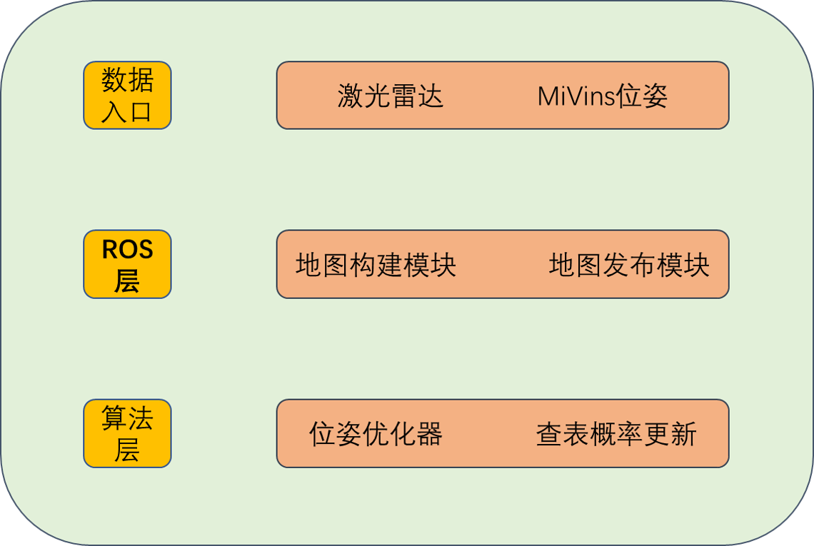

# cyberdog_occmap

## 1. 模块简介
cyberdog_occmap是一个基于单线激光雷达的在线栅格地图重建算法，基于输入的位姿和扫描点云实时生成相应栅格地图，基于查表更新和Protobuf等技术，实现了非常轻量化的实时栅格建图算法，我们的算法在NX平台上仅占用单核10%的CPU资源，为方便开发者进行二次开发，本项目将核心算法与ROS2进行了分离，核心算法放置在`3rdparty/occmap`路径下，开发者可参考ROS2接口进行二次开发使用。

## 2. 模块架构

<center>



</center>

## 3. 使用教程
本项目提供了一个最小例程，基于单线激光雷达扫描点云文件和其对应的位姿文件离线生成栅格地图。
源代码位于`3rdparty/occmap/example`，数据位于`3rdparty/occmap/data`。其中`info.txt`存储了时间戳和对应的位姿，存储格式为`timestamp x y z x y z w`，`pointcloud`文件夹存储每一帧的点云文件，以对应时间戳命名，`gridmap_node.yaml`为本例程所使用的参数文件。
首先基于**README**安装好核心算法依赖库(无需安装ROS2相关依赖)。
```bash
# build source code
cd 3rdparty/occmap
bash install.sh
# build example
cd ../example
mkdir build && cd build
cmake .. make -j4
# run demo
./demo ../../data/
```

## 4. 代码详解
本节对`demo.cc`中的api调用和实现过程进行解释。

3.1 初始化数据集路径
```cpp
const std::string root_path = argv[1];
const std::string config_file = root_path + "/gridmap_node.yaml";
std::vector<PointCloudPose> vpointcloud_pose = readDataset(root_path);
```

3.2 从`gridmap_node.yaml`文件解析参数，在使用前需要将`gridmap_node.yaml`中的`create_map_path`更改为当前系统的可用路径。
```cpp
transform::Eigentf eigentf;
ProbabilityParam probability_param;
SubMapParam submap_param;
FilesSaveParam files_save_param;
FilterParam filter_param;
CeresScanMatchingParam ceres_param;
MapBeautiParam mapbeauti_param;	
ParseParameters(config_file, eigentf, probability_param, submap_param, files_save_param, filter_param, ceres_param, mapbeauti_param);
if (boost::filesystem::exists(files_save_param.sub_range_data_path)) {
  std::cout << "remove path: " << files_save_param.sub_range_data_path << std::endl;
  boost::filesystem::remove_all(files_save_param.sub_range_data_path);
}
if(common::createFolder(files_save_param.sub_range_data_path)) {
  std::cout << "create path: " << files_save_param.sub_range_data_path << std::endl;
}
```

3.3 实例化建图入口对象
```cpp
auto g_mapper_ = std::make_shared<mapping::GridMapper>(eigentf, probability_param, submap_param, files_save_param, filter_param, ceres_param, mapbeauti_param);                                               	 
```

3.4 将点云数据插入地图
```cpp
for(auto& pointcloud_pose : vpointcloud_pose) {
std::unique_ptr<sensor::RangeDataCarto> range_data_ptr 
  = g_mapper_->AddRangeData(pointcloud_pose.time, pointcloud_pose.pointcloud, pointcloud_pose.pose, eigentf.laser2baselink);
}
```

3.5 生成地图，最终地图和二进制子图文件会保存在`create_map_path`路径下。
```cpp
g_mapper_->GenerateGrid("map");
```