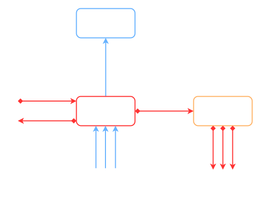
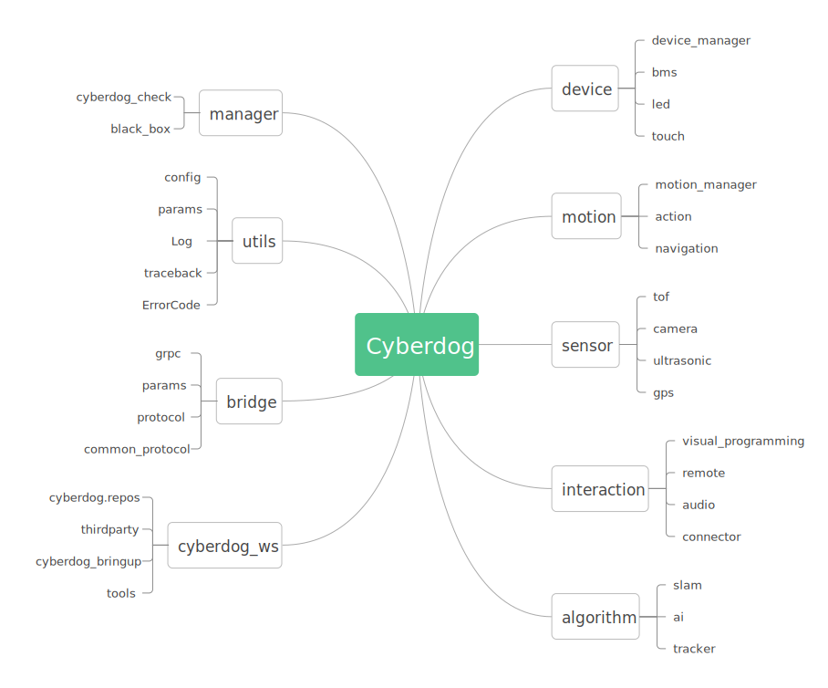

# Cyberdog 平台软件架构

## 概述

1. 迭代：演进路线
1. 名词：内部 / 外部 指NX板内和外；

## 演进路线

| Version | Author | Date | Change | Remark | FutureMind |
| --- | --- | --- | --- | --- | --- |
| 1.0 | 平台架构组 | 2022.1.1 |1.新架构release 2.创建git仓库|只做了框架和层级约定，实现细节待结合需求进一步细化|22.1.30   1.功能模块接口协议（部分）  2.状态机base class  3.机器人状态定义  4.全局code|
| 1.1 | 杜坤 | 2022.1.27 |1.功能模块接口协议（LED，快连） 2. 全局code  3.通信设计  4.机器人状态|1.机器人状态不是最终状态  2.协议只包含目前实现的模块  3.通信设计为初版|22.3.30   1.功能模块接口协议（全部）  2.全部功能模块设计  3.需求文档  4.机器人配置设计及应用|
| 1.2 | 平台架构组 | 2022.4.1 |1.功能模块设计 & 接口||22.4.30 1.性能测试脚本 2.单元测试|
| 1.3 | 杜坤 | 2023.04 |1.完善模块细节； 2.增加algorithm manager模块；|对应软件版本为V 1.1.0.3|发布版本|

## V1.3

### 架构

#### 框架图

#### 框架说明

1. 整体遵循ros开发模式，采用网状离散的模块设计；

1. 在此基础上，主要进行三层的层次划分（manager, core, actuator），会通过调用时的可见性原则进行功能封装；

1. 代码形式：manager及core为独立的进程，actuator通常为动态库；

#### 单元约定

##### Manager

1. 独立的ROS节点；

1. 管理内部执行单元状态，并对外提供执行单元的ROS调用接口；

1. 所有manager内部全局可见，任一单元均可调用；

1. 所有manager均维护心跳；

1. manager负责最终决策，但不执行具体逻辑功能；

1. 所有manager遵循同一套机器人状态机，由robot manager负责切换；

1. 以ROS 插件形式引入执行单元；

##### Core

1. 独立的ROS节点；

1. 控制单元独立完成一个或多个逻辑功能（如快速连接、导航、跟随等），通过调用manager所提供的执行单元接口完成；

1. 通过Bridge对外部可见，内部可见性视具体情况设计，不做约定；

1. 不为其它core提供能力支持，即本身功能之外，允许动态关闭而不产生关联影响；

1. 除业务强相关（如Navigation之于Motion），Core均划分并提交至Interaction仓库；

##### Actuator

1. 纯粹的执行单元，无业务逻辑，亦无决策；

1. 与硬件版本强耦合，不同硬件方案直接提供不同版本的代码，不做兼容；

1. 通过回调函数对外通信，内部不使用ros通信接口；

1. sensor与device的区分在于，前者强制要求通过manager持续发布状态，后者强制要求提供RPC服务接口；

1. 执行单元自身能力为串行，'busy'状态时直接返回ErrorCode，由manager处理；

1. 执行单元的状态机由manager切换；

##### Bridge

1. 应用板程序与外部通信的接口，由进程和动态库组成；

1. 对内提供ros接口；

1. 外部包含DDS、Can、Uart等；

1. Bridge只做消息转发，不参与任何具体业务；

### 模块画像

示意

#### Robot

##### RobotManager(CyberdogManager)

1. 切换所有manager状态机

1. 监听全局状态及关键信息

1. 提供service，其它模块主动上报状态（紧急，如低电量等）

##### Check

1. 机器人自检

1. 工厂功能检测

##### BlackBox

1. 监听关键信息并存储

1. 依据策略上传

1. 可配置

#### Motion

##### MotionManager

1. 管理运动模式

1. 接收其它模块的运动控制请求

1. 依据配置及运动模式做决策

1. 调用Action完成运动指令，并返回运动控制结果

##### Navigation

1. 监听传感器数据，并结合地图做出运动计算；

1. 调用Motion实现运动控制；

1. 不做最终决策；

1. 输入细节：
   1. 导航功能：
      1. 全局地图，八叉树

      1. tf转换(每个sensor到base\_link的tf转换）

      1. 局部地图，点云

      1. 视觉里程计

      1. 各种传感器数据（单线雷达，realsense）

   1. 跟随功能：
      1. 导航功能所需输入

      1. 目标点坐标（ODOM坐标系或者MAP坐标系）

##### Action

1. 通过bridge调用运动控制的接口；

1. 通信方式为ROS —— DDS；

1. Action接口供Motion调用，最终也会对外提供开源接口；

#### AlgorithmTask

##### PerceptionManager

1. 管理识别模块，包括ROS接口和CPU资源申请

1. 对系统全局发布数据并接收设置指令

##### Slam

1. 全局地图（2D / 3D）

1. 局部地图

##### Tracker

1. 目标点

##### AI

1. 人脸识别

1. 骨骼点识别

1. 手势识别

#### Sensor

##### SensorManager

1. 管理所有传感器，并为每一个传感器提供独立的数据发布通道

1. 可通过配置选择所挂载的传感器及版本

1. 如有需求，传感器支持软件级热插拔

##### Camera

_特别的 __sensor__ 能力_

1. photo拍照、视频

1. slam

1. follow

1. 情感

##### 其它

1. 以ros插件形式实现；

1. 遵循通用的sensor base以及自身的接口base；

#### Device

##### DeviceManager

1. 管理所有设备，并为每一个设备提供独立的调用接口

1. 对调用结果做一层解析，若发生错误，上报至CyberdogManager

1. 可通过配置选择所挂载的设备及版本

1. 如有需求，设备支持软件级热插拔

##### 其它

1. 以ros插件形式实现；

1. 遵循通用的device base以及自身的接口base；

#### 交互功能

该系列模块依赖于需求详细设计，因此架构层面不做过多约定；

##### Audio

1. 客户端包括其它ros节点的语音请求，和R329的语音触发；

##### VisualProgram

1. 图形化编程引擎；

1. 封装机器人能力接口，采用cpp 动态库实现；

1. 动态库的调用采用python脚本，用于跟app通信和调用；

##### Connector

1. 联网模块，使用二维码解析完成ssid和password的获取；

1. 通过IP和grpc与app进行连接 ；

1. 首次连接后，以后开机会自动连接；

### 仓库管理

每一个二级节点为一个独立的git仓库

仓库地址：

[MiRoboticsLab/rop (robot operating platform)](https://github.com/MiRoboticsLab/cyberdog_ws)

[Dockerfile使用说明](/cn/dockerfile_instructions_cn.md)

