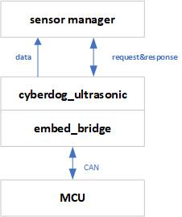
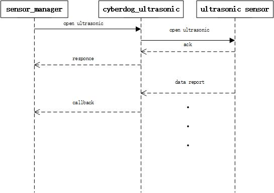
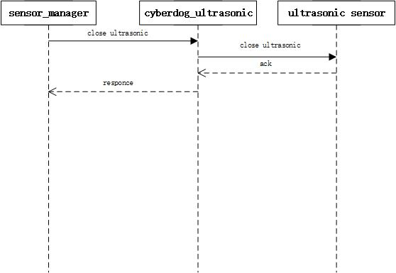

# cyberdog_ultrasonic设计

##  概述

cyberdog_ultrasonic 以ros2 plugin形式向客户端提供ultrasonic数据服务，此插件为控制传感器提供必要的API接口，并把采集到的ultrasonic数据转换成ros消息格式通过sensor manager反馈给客户端。cyberdog默认配置1个ultrasonic。

## 软件设计

#### 软件框架

 

<!--

数据流开启

 

数据流关闭

 

-->

## 功能设计

- 通过配置文件可灵活配置传感器个数、消息源、指令id等；
- 提供传感器使能、关闭、自检等基本能力接口；

## 配置文件

- 源码路径：``bridges/params/toml_config/sensors``
- 安装路径：``/opt/ros2/cyberdog/share/params/toml_config/sensors``
- 配置文件：
  - ``utrasonic_config.toml``:用于配置传感器个数和实际的配置文件
  - ``ultrasonic.toml``:用于配置头部传感器
- 主要配置说明：
  - ``config_files``:程序根据数组成员实例出对应的传感器实体
  - ``protocol``:通信协议，默认为CAN。
  - ``can_interface``:CAN通信的消息通道，可配置``can0``、``can1``
  - ``array``:数据包消息接收配置
    - ``array_name``:数据包名称
    - ``can_package_num``:数据包中，CAN数据帧的个数
    - ``can_id``:数据包中，CAN数据帧的``CAN_id``

  - ``cmd``:指令包消息发送配置
    - ``cmd_name``:指令包名称
    - ``can_id``:指令包中，CAN数据帧的``CAN_id``
    - ``ctrl_len``:指令包中，CAN数据帧的数据长度
    - ``ctrl_data``:指令包中，CAN数据帧的数据默认值

## ROS 协议
- 源码路径：``bridges/protocol/ros``
- Ros topic：``ultrasonic_payload``
- 协议介绍：
  - ``sensor_msgs::msg::Range``：单个Ultrasonic数据格式
    - 协议路径：``bridges/protocol/ros/msg/UltrasonicPayload.msg``

## API接口
  - ``Init(bool simulator)``：初始化配置
    - ``simulator = true``:配置为仿真模式
  - ``Open()``：打开传感器
  - ``Start()``：使能传感器
  - ``Stop()``：停止传感器
  - ``Close()``：关闭传感器
  - ``SelfCheck()``：传感器自检
  - ``LowPowerOn()``：进入低功耗模式
  - ``LowPowerOff()``：退出低功耗模式
  - ``SetSinglePayloadCallback(std::function<void(std::shared_ptr<protocol::msg::Range> payload)> cb)``：设置消息回调函数

## 调试命令
  - 获取ultrasonic topic：``ros2 topic list | grep ultrasonic_payload``