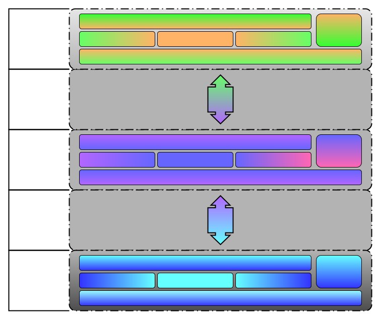
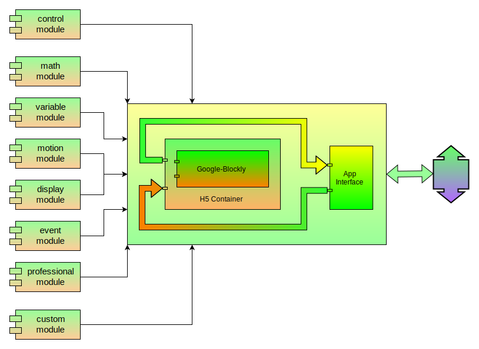

# 
cyberdog_vp 设计文档

## 1. 概述
可视化编程，亦即可视化程序设计：以“所见即所得”的编程思想为原则，力图实现编程工作的可视化，即随时可以看到结果，程序与结果的调整同步。可视化编程是与传统的编程方式相比而言的，这里的“可视”，指的是无须编程，仅通过直观的操作方式即可完成界面的设计工作，在此通过移动设备进行编程，机器人负责执行程序。

## 2. 设计
### 2.1. 操作流程设计
通过图形化编程APP端界面进行操作，详情可参见产品帮助手册。
### 2.2 技术架构

如上图所示，可视化编程由三大模块构成，其技术架构如下：
1. APP端：主要技术有kotlin、JS、Css、H5和谷歌Blockly。
2. 机器人端：主要技术有C++、Pybind11、Python、I-Python和ROS。
3. 服务器端：主要技术有Java、Redis、mysql、matrix和Spring-cloud。

APP端和机器人端通过grpc通信；机器人端和服务器端通过http或mqtt通信。

### 2.3 文件架构

如上图所示，是可视化编程所涉及的文件架构：
1. 模块：
    * 1个模块注册表包含多个模块；
    * 1个模块对应1个python文件；
    * 1个模块可以调用多个其他模块；
    * 1个模块可以被多个其他模块或任务调用；
2. 任务：
    * 1个任务注册表包含多个任务；
    * 1个任务对应1个python文件，1个shell文件和1个日志文件；
    * 1个任务可以调用多个模块；
    * 1个任务执行方式有两种：
        * 定时单次运行；
        * 定时周期执行

### 2.4 模块架构

如上图所示，是可视化编程所涉及的模块架构：
1. APP端：通过H5容器集成骨骼图形化编程框架到APP。
2. 服务器端：由web端后台管理系统、后台业务程序和数据库组成。
3. 机器人端：由可视化编程引擎、机器人能力集和终端交互式编程及调试模块组成。

基于I-Python实现交互式编程，基于pybind11实现C++和python的交叉编译及C++到python的接口映射。
#### 2.4.1 APP端模块架构

如上图所示，可视化编程APP端模块架构：
1. 编程基础类别：
    * 控制类：基础控制语法；
    * 数学类：四则运算；
    * 变量类：基础变量；
2. 机器人能力类别：
    * 运动类：基础运动；
    * 展示类：语音交互；
    * 事件类：AI识别；
    * 专业类：专业运动接口；
3. 编程依赖类别：
    * 自定义模块类。
#### 2.4.2 服务器端模块架构

如上图所示，可视化编程服务器端模块架构：
1. 服务器端提供一个web端的后台管理系统；
2. 服务器端业务程序API提供5种能力：
    * 保存模块或任务；
    * 查询模块或任务；
    * 删除模块或任务；
    * 分享模块或任务；
    * 收藏模块或任务。

#### 2.4.3 机器人端-引擎模块架构

如上图所示，可视化编程引擎模块架构：
1. 核心功能：
    * 解析及响应APP端消息；
    * 请求及处理服务器端消息；
    * 构造及注册模块或任务；
    * 控制任务运行。
2. 任务操作及模块操作参见任务及模块状态流转。

#### 2.4.3.1 机器人端-模块操作及状态流转设计

三种模块状态分别在三种模块操作下的流转关系尽收眼底，现对三种模块操作及三种模块状态进行说明如下：
* 三种模块操作
    1. 保存任务：构建当前id的模块，若模块id已存在则覆盖，并审核任务语法是否合规，反馈操作结果。
    2. 查询任务：查询当前id对应的模块，反馈操作结果。
    3. 删除任务：审核当前id对应的模块是否可以删除，若可以则删除当前id对应的模块，反馈操作结果。
* 三种模块状态
    1. 空状态：该状态是指没有当前模块的任何状态，本质为当前模块不存在，也就是说任何未记录的模块的状态均为空状态。
    2. 错误状态：该状态是指当前模块不符合语法规则，也就是说当前模块无法运行只能再次编辑。
    3. 正常状态：该状态是指当前模块符合语法规则，也就是说当前模块可以调用。

#### 2.4.3.2 机器人端-任务操作及状态流转设计

七种任务状态分别在八种任务操作下的流转关系尽收眼底，现对八种任务操作及七种任务状态进行说明如下：
* 八种任务操作
    1. 保存任务：构建当前id的任务，若任务id已存在则覆盖，并审核任务语法是否合规，反馈操作结果。
    2. 运行任务：运行当前id对应的任务，若任务id对应的任务不存在或语法状态错误则不执行，反馈操作结果。
    3. 查询任务：查询当前id对应的任务，反馈操作结果。
    4. 删除任务：删除当前id对应的任务，反馈操作结果。
    5. 暂停任务：暂停当前id对应的任务，反馈操作结果。
    6. 继续任务：继续当前id对应的任务，反馈操作结果。
    7. 终止任务：终止当前id对应的任务，反馈操作结果。
    8. 调试任务：以当前调试id为基础，保存、审核及运行当前帧携带的逻辑，反馈操作结果。
* 七种任务状态
    1. 空状态：该状态是指没有当前任务的任何状态，本质为当前任务不存在，也就是说任何未记录的任务的状态均为空状态。
    2. 错误状态：该状态是指当前任务不符合语法规则，本质为当前任务不合规，也就是说当前任务无法运行只能再次编辑。
    3. 等待运行状态：该状态是指当前任务可以运行但尚未加入任务注册表中，本质为当前任务语法规则，也就是说当前任务处于等待用户确认运行状态。
    4. 运行等待状态：该状态是指当前任务已加入任务注册表中，但尚未满足运行条件，本质为当前任务语法规则，且正在等待运行条件满足后即刻运行的状态。
    5. 运行状态：该状态是指当前任务已满足执行条件，正在执行内部逻辑的状态。
    6. 暂停状态：该状态是指当前任务处于暂停执行的状态，此时任务进程任在，可以是断点暂停或用户手动暂停正在执行的任务。
    7. 终止状态：该状态是指当前任务被终止执行，此时不存在任务进程，可以是正常执行结束或被迫终止任务。
* 注意：当前的任务状态是基于任务内编程逻辑考虑，不做任务执行约束条件考虑（由调用方考虑）：
* 当某条任务内编程逻辑审核通过，该任务状态即为等待运行（wait_run）状态，若该任务执行约束条件为定时单次执行时，需要调用方根据定时约束判断当前任务的约束时间是否已过期，当未过期时再开启任务。当然，也可以不用管，直接下发开启请求，但是会被视为非法请求，操作会失败，对用户操作体验不友好。

#### 2.4.3.3 机器人端-状态机各模式下操作约束设计

十种机器人模式下用户对任务或模块的八种操作，用户对AI能力的一种操作以及任务自行触发的两种操作约束条件尽收眼底，各模式下的约束指标主要考虑如下：
1. Uninitialized、SetUp、TearDown三种模式下，机器人各功能模块均处于无法正常工作的状态，故而限制所有操作；
2. SekfCheck、OTA以及Error模式下，机器人各功能模块均处于封闭状态，故而限制所有可能导致图形化编程新增进程的操作，只允许现有进程自动停止（stop）或用户手动暂停（suspend）或终止（shutdown）现有进程，允许查询（inquiry）是想为用户提供展示任务、模块及AI信息，为用户的暂停（suspend）或终止提供基础，同时也支持二次编辑任务或模块的功能，提升用户和机器人互动过程中的异步体验（不会因自检阻塞用户编程），该思想同样适用于Active、DeActive、Protected、LowPower、OTA以及Error模式；
3. Active模式下，机器人各功能模块均处于能够正常工作的阶段，故而开放所有操作；
4. Protected模式下，机器人大部分功能模块均处于能够正常工作的阶段，故而开放所有操作，该模式下受限功能如下：
    * 运动模块：除站立、趴下外的所有结果指令；
    * LED模块：BMS会抢占LED设备。
5. DeActive以及LowPower模式下，机器人各功能模块均处于休眠状态，查询（inquiry）、停止（stop）及暂停（suspend）或终止（shutdown）约束考虑和SekfCheck模式一样，对于保存（save）和删除（delete）操作的考虑和查询一样，也是想为用户提供展示任务、模块及AI信息，为用户的暂停（suspend）或终止提供基础，同时也支持二次编辑任务或模块的功能，提升用户和机器人互动过程中的异步体验（不会因自检阻塞用户编程）。

  
 注意 

  <pre><blockcode>🟥 低电量模式：
    🔵 进入：
        🔺电量低于20%，自动进入；
    🟠 退出：
        🔺电量大于等于20%，自动退出；
🟩 低功耗模式
    🔵 进入：
        🔺电量小于5%时自动进入低功耗；
        🔺趴下超过30s，进入低功耗；
        🔺唤醒退出低功耗模式后，若30s内未进行运动控制，则再次进入低功耗模式；
    🟠 退出：
        🔺语音唤醒：“铁蛋、铁蛋”；
        🔺app端点击退出低功耗；
        🔺双击狗头退出低功耗；</blockcode></pre>

#### 2.4.4 机器人端-铁蛋能力集模块架构

如上图所示，可视化编程铁蛋能力集模块架构：
* 10种设备（传感器）：触摸板、电池、超声波、雷达、里程计、语音、led、IMU、TOF、GPS。
* 13种功能：运动、导航、任务控制、日志记录、网络状态、训练词、手势识别、人员信息、运动识别（基于骨骼点）、人脸识别、声纹识别、皮肤控制及跟随功能。其中，皮肤控制和跟随功能预留，等待适配业务场景。
* 2种API：基于同一个机器人能力集实现动态库，同时开放C++ API和Python API。

#### 2.4.5 机器人端-终端交互式编程与调试模块架构

如上图所示，可视化编程铁蛋能力集模块架构：
* 2种能力：
    1. 终端下交互式编程：基于Python API实现终端编程，用于高级玩家，同时也是研发过程中脱离APP进行Python API的调试工具。
    2. 终端下调试工具：主要调试图形化编程引擎和机器人能力集C++ API，同时提供了终端下的API帮助文档功能。

## 3 附录
### 3.1 自定义动作说明
MIT开源代码 Cheetah Software，包括其他开源软件，对于四足机器人的步态定义都是针对周期步态，通过定义周期，占空比和相位差来完全确定一个步态。步态可以理解为机器人的每条腿支撑和摆动相位随时间变化的关系，周期步态是指每条腿的支撑相和摆动相是周期变化的，比如四足机器人对角步态走路就是典型的周期步态。定义的步态配合相应参数，包括躯干的轨迹，落足点的位置，抬脚的高度等，就形成了不同的动作，简单来说就是“步态定义+步态参数=动作”。

周期步态可以实现周期的动作，比如走路、奔跑等，但是舞蹈动作往往没有一个严格的周期，所以就需要一种定义非周期步态并编辑步态参数的方法。而且，所有开源软件都是在代码中定义的步态，这样修改性就比较差，每次修改都需要编译代码，所以我们的目的是开发一种基于图形化的非周期步态定义和编辑方法，不仅可以提高开发效率，也方便用户去修改或新建自己的步态，生成自己的舞蹈动作，降低用户的开发门槛，提高机器人的可玩性，让每个用户都可以开发自己喜欢的步态。

机器人坐标系如图 1所示，四条腿分别以FL（Front-left），FR（Front-right），RL（Rear-left），RR（Rear-right）来命名。

步态表示每条腿支撑和摆动相位随时间变化的关系，为了方便修改，我们将步态定义内容以文件的形式存储。

每一个步态块表示一个步态单元，每个步态单元内包括支撑状态和持续时间。对于支撑状态1表示支撑，0表示摆动，四个数字分别代表FR，FL，RR，RL四条腿；持续时间表示支撑状态持续N个单位时间，单位时间是30毫秒。对应的时间为Ti=Ni*30ms (i=1...8)，步态约束格式参见可视化编程-接口文档 中的MotionSequenceGait类型。

步伐参数文件用于描述步态运行中的所有参数，每一个步伐块代表一个参数单元，包括躯干的速度、位置和姿态，摆动腿的落足点，以及摆动腿的抬腿高度，另外还需要指明当前地面与足底的摩擦系数以免打滑，最后就是这个步态的持续时间，步伐约束格式参见可视化编程-接口文档 中的MotionSequencePace类型。

需要注意的是，步态定义和步态参数的持续时间是相关的，但并不是一一对应的。一般只有在支撑相位变化时才需要规定落足点。

完成步态定义和步态参数后，就开始了动作的执行。这里需要将定义的步态和相应的参数转化为每一个时刻计算机器人所有的期望状态。

对于躯干，期望的状态包括位移、姿态、线速度和角速度，在步态参数文件中，如果某个方向指定了期望速度，那么这个方向的期望位移就根据速度的积分获得。以Moonwalk第一个参数块为例，在x方向指定了速度为vx，持续时间为T1，那么x方向期望的位移就vx*T1，body_pos_des中x方向的期望位移0.0就不会被使用。如果速度为0.0，那么就与以body_pos_des中定义的位移为准，期望速度就为位移除以时间，其他的方向与x方向逻辑相同。在实际使用中，平移运动一般通过速度定义，因为用户比较关心机器人往那个方向运动，对于具体的运动距离并没有特别要求；旋转运动一般通过定义姿态，因为用户更关心旋转的角度而不是速度。

对于摆动腿，需要计算它的摆动轨迹，我们使用三阶贝塞尔曲线，只需要指定曲线初始的位置速度和终点的位置速度就可以计算出每个时刻的位置。这里说的x，y，z方向都有各自的贝塞尔轨迹，描述的是对应方向的位移与时间的关系。摆动腿的起点就是支撑状态的终点，不需要用户指定，用户只需要指定每条腿的摆动终点即可，也就是落足点。其中x，y方向只有一个终点，计算一条贝塞尔曲线即可，z方向由于有抬腿高度的需求，所以包括抬起和落下，需要两条贝塞尔曲线。由于摆动腿抬起和落地时刻相对于地面的速度都是零，所以通过给定的落足点和抬脚高度，就可以计算出摆动腿的轨迹了。

有了躯干的期望状态和摆动腿的期望状态，又已知支撑腿相对地面不能运动，这样就可以完全确定此时刻机器人的期望状态。利用MPC+WBC的开源控制算法或者其他运动控制算法都可以实现当前状态下动作的执行。
每一时刻都会检测动作执行是否完成，完成的标志就是执行时间到达用户定义的总时间，如果执行完成，机器人就进入站立状态等待下一个指令；否则就时刻增加dt，继续执行动作。
