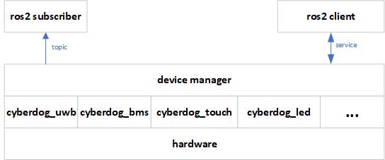

# device_manager

##  概述

``device_manager`` 是``cyberdog_touch``、``cyberdog_uwb``、``cyberdog_bms``等功能模块的管理模块;为各模块提供状态机管理、服务回调、消息发布的能力,各模块以ros plugin形式加载到``device_manager``。

##  软件设计

<center>

 

</center>

##  功能设计

### 模块加载

- [ROS plugin](https://github.com/ros2/ros2_documentation/blob/galactic/source/Tutorials/Beginner-Client-Libraries/Pluginlib.rst)

- ``device_manager``使用 ``pluginlib::ClassLoader``加载``cyberdog_uwb``等各模块。
```
  // 加载过程参考ros样例
pluginlib::ClassLoader<polygon_base::RegularPolygon> poly_loader("polygon_base", "polygon_base::RegularPolygon");

std::shared_ptr<polygon_base::RegularPolygon> triangle = poly_loader.createSharedInstance("polygon_plugins::Triangle");
    
```

### 状态机管理

- 状态机管控各外设模块，如:控制``cyberdog_led``等模块的“低功耗”和“激活”状态切换；

- ``device_manager``继承``cyberdog::machine::MachineActuator``，客户端可通过``cyberdog::machine::MachineActuator``提供的服务接口，控制``device_manager``状态切换。在状态机内部，对已加载的各模块依次进行对应状态的控制。

- 状态机详细介绍参考: [状态机设计](/cn/cyberdog_machine_cn.md)

### Topic&Service

- ``device_manager``提供的ros message接口，客户端可订阅外设数据topic获取外设数据。
- ``device_manager``提供的ros service接口，客户端可通过外设控制服务控制外设状态。
- ROS接口: 
  - ``protocol::msg::TouchStatus``:touch消息
  - ``protocol::msg::BmsStatus``：bms消息
  - ``protocol::msg::UwbRaw``：uwb消息
  - ``protocol::srv::GetUWBMacSessionID``：获取uwb mac服务
  - ``protocol::srv::LedExecute``：led控制服务

### 模块插件

[蓝牙模块](/cn/cyberdog_bluetooth_cn.md)
[bms模块](/cn/cyberdog_bms_cn.md)
[led模块](/cn/cyberdog_led_cn.md)
[touch模块](/cn/cyberdog_touch_cn.md)
[uwb模块](/cn/cyberdog_uwb_cn.md)
[wifi模块](/cn/cyberdog_wifi_cn.md)

## 调试命令

  - 获取device_manager状态机服务：``ros2 topic list | grep device_manager``
  - 状态机切换(切换到“Active”状态)：

```
ros2 service call /`ros2 node list | grep "mi_" | head -n 1 | cut -f 2 -d "/"`/device_managermachine_service  protocol/srv/FsMachine  "{target_state: "Active"}"
```
