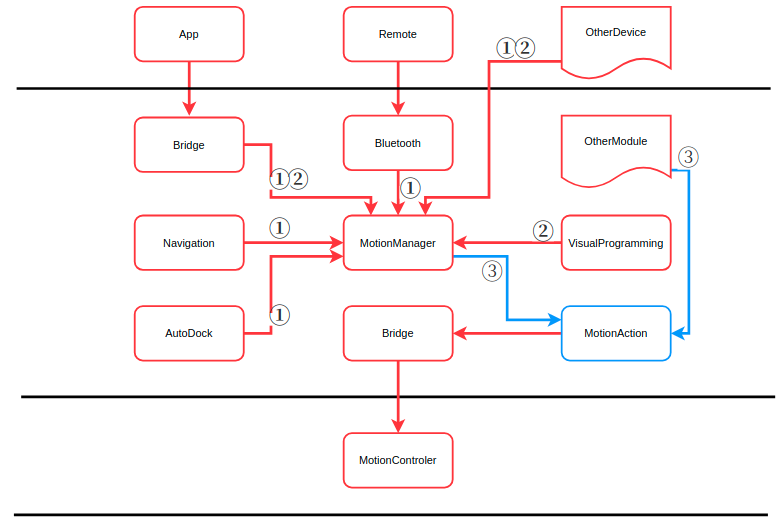
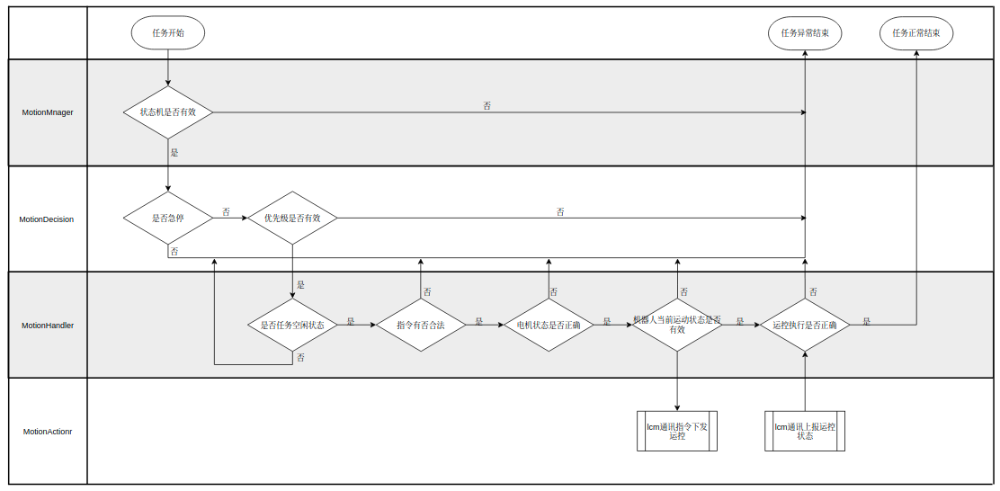

# 运动管理设计文档

## 概述
运动管理模块是对运动控制功能的集中管理，所有的运控调用功能均由该模块向运控层转发，并获取运控的状态反馈。对于用户的对运控的调用指令，该模块将根据系统的整体状态机、电量状态、运动状态进行集中决策和执行。
## 模块架构

### 软件架构图

<center>



</center>

### 架构说明

#### 角色说明

 MotionManager

- Cyberdog软件体系的运动管理接口，在内部分为三层：MotionManager、MotionDecision、MotionHandler，其中MotionManager继承了CyberdogManager的状态机，实现了自检、低电量、低功耗、关机、OTA等不同的状态。MotionDecision依据机器急停状态、指令优先级等做决策；MotionHandler判断指令合法性、机器任务状态、电机状态等做进一步管理指令。
- 所有需要运行在Cyberdog框架内的运控调用，只能通过该模块的接口。
- 接口有自己维护的业务逻辑，即调用接口会得到返回，但不一定有运动响应，返回码中统一定义了所有的异常。

 MotionAction

- 作为NX主控板与运控板的唯一接口，以lcm通讯协议向运控板下发所有的运动指令，同时将运控板的实时状态上报NX主控板
- 根据运控定义的所有动作，管理维护所有的动作属性清单，包括运控定义每个动作的mode与gait_id属性与MotionManger对外定义motion_id的映射、每个动作允许衔接的前后状态与指令。


## 接口类型说明

- 将所有动作进行封装，对外提供结果指令、伺服指令以及自定义动作指令三种接口，其中自定义动作指令只开放给可视化编程，其他指令开放给所有调用方。
- 伺服指令主要面向运控板所定义的locomotion动作，即慢走、快走、小跑、跳跑等动作。此类指令下发运控后，运控会按照最后一帧的相关参数，如速度、抬腿高度等维持状态。在APP等需要grpc通讯的场景下，为避免通讯断连后运控方的失控状态，要求APP等上层下发的指令间隔时长默认不多于200ms，否则将强制认为通讯超时，并向运控板下发站立指令实现停止状态。
- 伺服指令实现了多方协同控制，如APP、蓝牙手柄、导航任务等，内部定义了不同的指令优先级，按照优先级实现控制权管理，值越小代表优先级越高。以下是默认的优先级定义：

```C%2B%2B
App = 0 # 安卓APP
Audio = 1 # 语音
Vis = 2 # 可视化编程
BluTele = 3 # 蓝牙手柄
Algo = 4 # 导航跟随等任务
```

## 运动控制流程

<center>



</center>