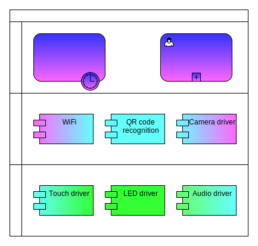

# 
connector design document

##  Directory 
* [1. Revise](#1-revise)
* [2. Overview](#2-overview)
* [3. Design](#3-design)
    * [3.1. Feature design](#31-feature-design)
    * [3.2. modular design](#32-modular-design)
---
## 1. Revise

Item|Software Version|Protocol Version|Revision Date|Reviser|Remarks
:--:|:--|:--|:--:|:--:|:--:
connector|V1.1.0.0|V1.0.0.0|2023-02-06|ShangZihan|none

## 2. Overview
The bionic robot quickly connects to the network and the target device (hereinafter referred to as fast connection) mainly has the following characteristics:
1. The bionic robot is in a WiFi environment;
    * WiFi can be a third-party routed WiFi;
    * WiFi can also be a hotspot placed outside the device where the APP is located.
2. The device where the App is located has been connected to the target WiFi;
3. The app initiates the bionic robot to connect to the target WiFi;
4. After the bionic robot successfully connects to the target WiFi, it connects to the device where the target APP is located;
5. Finally, quickly establish a connection with the target WiFi and device.

## 3. Design
### 3.1. Feature design

There are two main quick connection functions:
1. Distribution network function: realize the switch by long pressing the touch;
2. Automatic connection: realized through the system's own reconnection mechanism.

### 3.2 Technology architecture

As shown in the figure above, the composition of the bionic robot fast connection network and target device architecture and the main functions of each component are as follows:
1. touch: Provide the robot head touch signal.
2. LED: Provides the function of displaying the lighting effects on the robot's head and body.
3. audio: Provide robot voice broadcast function.
4. camera: Provide image data within the field of view.
5. QRreader: Provides QR code recognition function.
6. WiFi: Provides the target WiFi connection function of the linux system.
7. App: Provides the function of generating QR codes carrying WiFi information.
