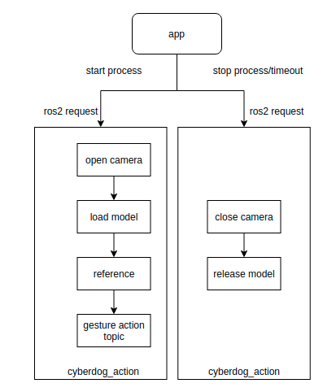

# Cyberdog_action Design

## 1. Functional Overview

At present, the gesture recognition module provides a service and a topic. The service is used to activate the gesture recognition function. After activation, within the specified timeout, the node will publish the topic of the detected gesture action id. source code location：
https://github.com/MiRoboticsLab/interaction/tree/rolling/cyberdog_actionhttps://github.com/MiRoboticsLab/interaction/tree/rolling/cyberdog_action

## 2. Architecture Design

<center>

 
 cyberdog_action architecture Diagram


</center>


- app：It is a function module that calls gesture_action,   such as a visual programming module
- cyberdog_action provides ros2 service interface to control the gesture action recognition on, off and timeout。
- Start the processing flow: After cyberdog_action receives the request to start the algorithm, it needs to turn on the camera, load the model, reason frame by frame, and publish the recognition result in the form of ros2 topic
- Closing process: cyberdog_action needs to close the camera and release the model after receiving the request to close the algorithm or the request timeout


## 3.API interface
```Makefile
- bool ReadTomlConfig():Read relevant parameters from the configuration file, such as frame rate, model path, version, etc
- int activation_function_softmax(const _Tp * src, _Tp * dst, int length, int & max_index):Perform softmax operation on the classification results of the model.
-   void Gesture_Action_Rec_Fun(
    const std::shared_ptr<GestureActionSrv::Request> request,
    std::shared_ptr<GestureActionSrv::Response> response):Process the client's request, open the algorithm for a period of time or close the algorithm immediately according to the requested parameters.
- void CameraSignalCallback(const CameraMsg::SharedPtr msg):The callback function of camera image data topic.
- void Camera_Operate():Image data processing thread, including updating the reasoning model, loading the model, cuda memory initialization, controlling the running time of the algorithm, terminating the algorithm, etc.
- void Inference_Operate():Model inference and result optimization post-processing.
- uint8_t ControlCamera(uint8_t _action):Open and close the camera data stream.
- int doInference():model reference.
- int process_history(int max_index):By accumulating and judging multiple frames of data, the accuracy of action recognition is improved.
- int proprecess(Gesture_ori max_index):: Filter gestures that are easy to be misrecognized.
- bool LoadEngineIntoCuda():load tensorrt model。
- bool DestroyCuda():Release gpu memory and context resources.
- bool cudaMemoryPro():Handle cuda memory and context resources required for inference.
- void WifiSignalCallback(const WifiMsg::SharedPtr msg):The callback function of WIFI signal monitoring is used to update the model online when there is a network.
```

## 4. Interface

- Interface File ：

protocol/srv/GestureActionControl.srv
protocol/msg/GestureActionResult.msg

- Configuration File ：

Locate：/params/toml_config/interaction/gesture_action.toml

```Makefile
device = 0                  # cuda device id 
queue_size = 5              # Prediction result queue length
frames_number = 3           # filter threshold
refine_output = true        # refine output or not
softmax_thres = 0.5         # softmax threshold
fps = 30                    # fps
engine_path = "/SDCARD/vision/gesture_action/gesture_action.trt" # model path
is_specified = false        # download the newest model from fds or the special verison
version = "0.0"             # fixed model version
```


## 5. some usefull case

```C%2B%2B
//Turn on the motion recognition function, and set the timeout to 60s
ros2 service call /`ros2 node list | grep "mi_" | head -n 1 | cut -f 2 -d "/"`/gesture_action_control protocol/srv/GestureActionControl "{command: 0,timeout: 100}"
// Turn off motion recognition

ros2 service call /`ros2 node list | grep "mi_" | head -n 1 | cut -f 2 -d "/"`/gesture_action_control protocol/srv/GestureActionControl "{command: 1,timeout: 100}

```

## 6. model path

/SDCARD/vision/gesture_action/gesture_action.trt。

## 7. References:

- the model in this repo comes from <https://github.com/mit-han-lab/temporal-shift-module>，thanks to their great work.