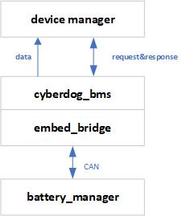
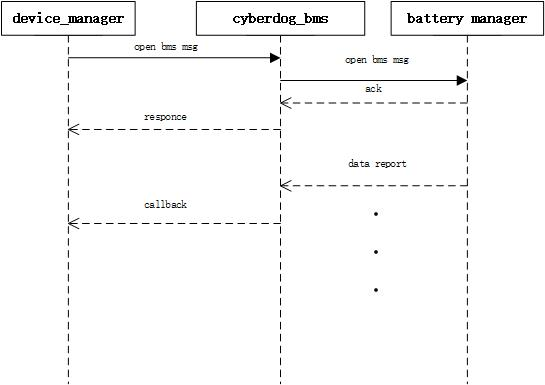

# cyberdog_bms design document

## 1 Overview

``cyberdog_bms``  provides bms data service to the client side in the form of ros2 plugin. This plug-in provides the necessary API interface for controlling bms, and converts the collected power board data into ros message format and publishes it through device_manager.

## 2 Software Design

### 2.1 Software framework

<!--
2.2 Data stream on

2.3 Data stream closed

-->
## 3 Functional design

- Flexible configuration of message sources, command ids , etc. through configuration files
- Provide basic ability interfaces such as enable, shutdown, and self-check

## 4 Configuration files

- Source path: ``bridges/params/toml_config/device``
- Installed path：``/opt/ros2/cyberdog/share/params/toml_config/device``
- Configuration file:
  - ``battery_config.toml``: used to configure bms modules
-Main configuration instructions:
- Main configuration description:
  - ``Protocol``: communication protocol, default is ``CAN``.
  - ``can_interface``: Message channel for CAN communication, configurable     ``can0``, ``can1``
  - ``Array``: data packet message reception configuration
    - ``array_name``: data packet name
    - ``can_package_num``: the number of CAN data frames in the data packet
    - ``can_id``: data packet, CAN data frame ``CAN ID``

  - ``cmd``: command packet message sending configuration
    - ``cmd_name``: instruction package name
    - ``can_id``: instruction package, CAN data frame ``CAN ID``
    - ``ctrl_len``: The data length of the instruction data frame in the CAN package
    - ``ctrl_data``: Data default value of instruction data frame in CAN package

## ROS protocol
- Source path: "bridges/protocol/ros"
- Ros topic：``bms_status``
- Agreement introduction:
  - ``Protocol:: msg:: BmsStatus``: Power management module data format
    - Protocol path：``bridges/protocol/ros/msg/BmsStatus.msg``
##  5 API interface
- ``bool Init(std::function<void(BmsStatusMsg)>function_callback, bool simulation)``：initialize configuration
  - ``simulator = true``:Configure to emulate mode
  - ``function_callback``:Set callback function for message.
- ``Open()``: Open BMS message reporting
- ``Close()``: Stop BMS message reporting
- ``SelfCheck()``: BMS self-check
- ``LowPower()``: enter low power mode
- ``void ServiceCommand(const std::shared_ptr<protocol::srv::BmsCmd::Request> request,std::shared_ptr<protocol::srv::BmsCmd::Response> response)``:ros2 service,using for ctrl bms.

## Debug command
  - Get bms topic：``ros2 topic list | grep bms_status``