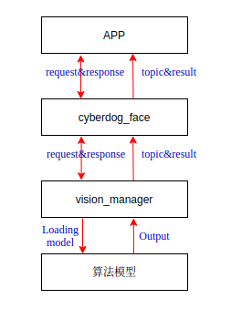

# Cyberdog_face Design

## 1. Function Overview

 - __cyberdog_face__: It is one of the modules to interact with the AI capability of the APP and Robotics, which mainly contains two major functions of face entry and face recognition.
 - __Face Entry__: Cyberdog_face accepts upper layer requests for face entry, face deletion, face update, etc.
 - __Face Recognition__: Cyberdog_face accepts upper layer requests to implement face recognition function.

<center>

 

</center>

## 2. Design of face entry/recognition software 
### 2.1 Software framework

<center>

 

</center>

### 2.2 Design flow chart

<center>


</center>

### 2.3 ROS protocol
- Source code path:``bridges/protocol/ros``
- Face entry protocol file
  - ``protocol/srv/FaceEntry.srv``：Face entry Service protocol.
  - ``cyberdog_face_entry_srv``：Face entry Service name.
  - ``protocol/msg/FaceEntryResult``：Face entry Topic protocol.
  - ``face_entry_msg``：Face entry Topic name.
- Face recognition protocol file
  - ``protocol/msg/FaceRecognitionResult``：Face recognition Service protocol.
  - ``cyberdog_face_recognition_srv``：Face recognition Service name.
  - ``protocol/msg/FaceRecognitionResult``：Face recognition Topic protocol.
  - ``face_rec_msg``：Face recognition Topic name.

## 3. Face entry function
``cyberdog_face`` receives the face entry request by service, returns response and sends the face entry algorithm request to the bottom layer, listens to the topic sent by the bottom layer, and sends the face entry result to the top layer through the topic.

### 3.1 Add face
``cyberdog_face`` adds a face to the underlying face database.

```
ros2 service call /`ros2 node list | grep "mi_" | head -n 1 | cut -f 2 -d "/"`/cyberdog_face_entry_srv protocol/srv/FaceEntry "{command: 0,username: XiaoMing,oriname: ,ishost: false}"
```

### 3.2 Cancel to add face
``cyberdog_face`` is in the process of face entry, send a cancellation to add a face to the entry.

```
ros2 service call /`ros2 node list | grep "mi_" | head -n 1 | cut -f 2 -d "/"`/cyberdog_face_entry_srv protocol/srv/FaceEntry "{command: 1,username: XiaoMing,oriname: ,ishost: false}"
```

### 3.3 Confirm face entry
``cyberdog_face`` sends the confirmation to add the face again after the face is added successfully, if it is successful then the underlying database adds the face successfully.

```
ros2 service call /`ros2 node list | grep "mi_" | head -n 1 | cut -f 2 -d "/"`/cyberdog_face_entry_srv protocol/srv/FaceEntry "{command: 2,username: XiaoMing,oriname: ,ishost: false}"
```

### 3.4 Update face ID
``cyberdog_face`` updates the user name in the underlying face database.

```
ros2 service call /`ros2 node list | grep "mi_" | head -n 1 | cut -f 2 -d "/"`/cyberdog_face_entry_srv protocol/srv/FaceEntry "{command: 3,username: XiaoHong,oriname: XiaoMing,ishost: false}"
```

### 3.5 Delete face
``cyberdog_face`` receives a request to delete the id of a face, and deletes the face with the specified id from the underlying database.

```
ros2 service call /`ros2 node list | grep "mi_" | head -n 1 | cut -f 2 -d "/"`/cyberdog_face_entry_srv protocol/srv/FaceEntry "{command: 4,username: XiaoHong,oriname: ,ishost: false}"
```

### 3.6 Get all the face
``cyberdog_face`` gets information about all faces in the underlying database.

```
ros2 service call /`ros2 node list | grep "mi_" | head -n 1 | cut -f 2 -d "/"`/cyberdog_face_entry_srv protocol/srv/FaceEntry "{command: 5,username: ,oriname: ,ishost: false}"
```

## 4. Face recognition function
``cyberdog_face`` receives the face recognition request by service, returns response and sends the face recognition algorithm request to the bottom layer, listens to the topic sent by the bottom layer, and sends the result of face recognition to the top layer through the topic.

### 4.1 Identify whether the current face exists in the face database
``cyberdog_face`` determines whether the currently recognized face exists in the underlying database. If it does, the nickname of the recognized face will be sent out.

```
ros2 service call /`ros2 node list | grep "mi_" | head -n 1 | cut -f 2 -d "/"`/cyberdog_face_recognition_srv protocol/srv/FaceRec "{command: 0,username: XiaoMing,id: 11111111,timeout: 30}"
```

### 4.2 Identify whether the face with the specified username exists in the face database
``cyberdog_face`` determines whether the face that identifies the specified nickname exists in the underlying database corresponding to its nickname. If the identification is successful, the user nickname is sent; otherwise, no face is identified.

```
ros2 service call /`ros2 node list | grep "mi_" | head -n 1 | cut -f 2 -d "/"`/cyberdog_face_recognition_srv protocol/srv/FaceRec "{command: 1,username: XiaoMing,id: 11111111,timeout: 30}"
```

### 4.3 Cancel recognition of user's face
``cyberdog_face`` is in the process of face recognition, send a request to cancel the current face recognition.

```
ros2 service call /`ros2 node list | grep "mi_" | head -n 1 | cut -f 2 -d "/"`/cyberdog_face_entry_srv protocol/srv/FaceRec "{command: 2,username: XiaoMing,id: 11111111,timeout: 30}"
```

## 5. Running ROS2 program for cyberdog_face

```
ros2 run cyberdog_face cyberdog_face --ros-args -r __ns:=/`ros2 node list | grep "mi_" | head -n 1 | cut -f 2 -d "/"`
```