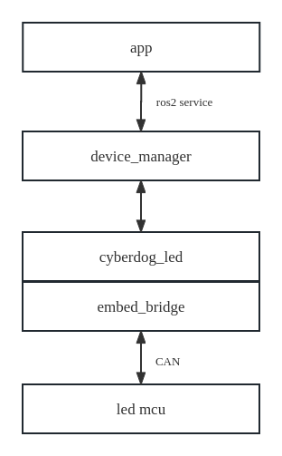

# Cyberdog_led Design
## 1. Functional Overview
  The cyberdog_led module is responsible for the control of the head led, tail led l and mini led effect in the system.


## 2. Architecture Design

<center>

 

</center>


   - app is an application module that needs to use LEDs in the system, such as bms, tracking, connector, visual programming module, etc.
   - device_manager is the management module of all devices in the system, and the provides an external led calling interface in the form of ros2 service。
   - cyberdog_led has realized the control and implementation of the LED function in the system in the form of ros2 plugin.
   - embed_bridge provide the general interface of the underlying can utils command
   - led mcu embedded control program including head led, tail led, mini led


   ### 2.1 ROS2 Service protocol

   #### 2.1.1 srv 

  The led module uses the ros2 service method to provide services, and the application  (such as "bms", "connector", etc.) executes the required equivalent by sending a request. The led plugin will use the priority policy to determine whether to play the requested led effect immediately.

   - service file: "bridge/protocol/ros/srv/LedExecute.srv"
 
   

  #### 2.1.2 Command line test example

   - case1: The connector module requests to set the current led effect of the head led to the system preset code 0xA1 (red light on) 

   ```Python
   ros2 service call /`ros2 node list | grep "mi_" | head -n 1 | cut -f 2 -d "/"`/led_execute protocol/srv/LedExecute "{occupation: 1, client: "connector", target: 1, mode: 1, effect: 0xA1}"
   ```

   

   - The connector module requests to select the custom mode for the current effect mode of the tail led, and select 0x02 (blinking) for the basic effect. R, G, and B pixel values ​​are set to 255, 0, and 0, respectively.

   ```Python
   ros2 service call /`ros2 node list | grep "mi_" | head -n 1 | cut -f 2 -d "/"`/led_execute protocol/srv/LedExecute "{occupation: 1, client: "connector", target: 2, mode: 2, effect: 2 ,r_value: 255, g_value: 0, b_value: 0}"
   ```

   - case3: requests to turn off the head led

   ```Python
   ros2 service call /`ros2 node list | grep "mi_" | head -n 1 | cut -f 2 -d "/"`/led_execute protocol/srv/LedExecute "{occupation: 1, client: "connector", target: 1, mode: 1, effect: 0xA0}"
   ```

   - case4: The connector module requests to release the head led, allowing low-priority users to control.

   ```Python
   ros2 service call /`ros2 node list | grep "mi_" | head -n 1 | cut -f 2 -d "/"`/led_execute protocol/srv/LedExecute "{occupation: 0, client: "connector", target: 1}"
   ```

   - case5: The connector module requests to select the system custom mode for the current  effect mode of the mini led,  select 0x34.

   ```Python
   ros2 service call /`ros2 node list | grep "mi_" | head -n 1 | cut -f 2 -d "/"`/led_execute protocol/srv/LedExecute "{occupation: 1, client: "connector", target: 3, mode: 1, effect: 0x34}"
   ```

   

   - case6: The connector module requests to select the custom mode for the effect mode of the mini led, and select 0x31 (drawing a circle) for the basic lighting effect. R, G, and B pixel values ​​are set to 0, 0, and 255, respectively

   ```Python
   ros2 service call /`ros2 node list | grep "mi_" | head -n 1 | cut -f 2 -d "/"`/led_execute protocol/srv/LedExecute "{occupation: 1, client: "connector", target: 3, mode: 2, effect: 0x31, r_value: 0, g_value: 0, b_value: 255}"
   ```

   - case7: The connector module requests to turn off the mini led.


   ```Python
   ros2 service call /`ros2 node list | grep "mi_" | head -n 1 | cut -f 2 -d "/"`/led_execute protocol/srv/LedExecute "{occupation: 1, client: "connector", target: 3, mode: 1, effect: 0x32}"
   ```

   - case8:The onnector module requests to release the mini led, allowing low priority users to control.

   ```Python
   ros2 service call /`ros2 node list | grep "mi_" | head -n 1 | cut -f 2 -d "/"`/led_execute protocol/srv/LedExecute "{occupation: 0, client: "connector", target: 3}"
   ```

  ## 3. Prioritization strategy

   - LED occupancy is managed using a priority strategy. Higher priority module requests will preempt lower priority module occupancy,The strategy is described in /opt/ros2/cyberdog/share/params/toml_config/device/led_priority.toml

   ```Lua
  The toml configuration file is used to specify the priority of the led used by each module. Head led, tail led, and mini leds follow the same priority configuration.

# The smaller the id, the higher the priority
   
   [[priority]]
   client = "lowpower"
   id = 0
   
   [[priority]]
   client = "bms"
   id = 1
   
   [[priority]]
   client = "connector"
   id = 2
   
   [[priority]]
   client = "vp"
   id = 3
   
   [[priority]]
   client = "tracking"
   id = 4
   
   [[priority]]
   client = "system"
   id = 5
   ```


   - The rgb values ​​of commonly used colors, as well as related configurations of system default effects, can be found in /opt/ros2/cyberdog/share/params/toml_config/device/led_color_config.toml

   ```Makefile
   # The toml configuration file is used to specify the r, g, b values ​​of the rgb led preset color.
   
   blue = [44,252,255]
   dark_blue = [0 ,20,100]
   bright_blue = [44,252,255]
   yellow = [255,150,0]
   orange = [255,30,0]
   pink = [255,100,255]
   red = [255,50,50]
   
   
   [system_headled]
   occupation = true
   client = "system"
   target = 1        # head led 
   mode =  2         # user defined mode
   effect =  9       # shine one by one
   r_value = 6       # blue
   g_value = 33
   b_value = 226
   
   [system_tailled]
   occupation = true
   client = "system"
   target = 2        # tail led
   mode =  2         # user defined mode
   effect =  9       # shine one by one
   r_value = 6       # blue
   g_value = 33
   b_value = 226
   
   [system_miniled]
   occupation = true
   client = "system"
   target = 3        # mini led
   mode =  2         # user defined mode
   effect =  48      # shine one by one
   r_value = 6       # blue
   g_value = 33
   b_value = 226
   ```