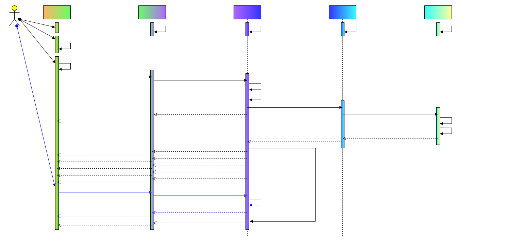

# 
cyberdog_vp design document

##  Directory 
* [1. Revise](#1-revise)
* [2. Overview](#2-overview)
* [3. Design](#3-design)
    * [3.1. Operation process design](#31-operation-process-design)
    * [3.2. Technology architecture](#32-technology-architecture)
    * [3.3. Interactive timing](#33-interactive-timing)
    * [3.4. File structure](#34-file-structure)
    * [3.5. Modular architecture](#35-modular-architecture)
        * [3.5.1. Frontend module architecture](#351-frontend-module-architecture)
        * [3.5.2. Backend module architecture](#352-backend-module-architecture)
        * [3.5.3. Robot side engine module architecture](#353-robot-side-engine-module-architecture)
            * [3.5.3.1. Robot side module operation and state flow design](#3531-robot-side-module-operation-and-state-flow-design)
            * [3.5.3.2. Robot side task operation and state flow design](#3532-robot-side-task-operation-and-state-flow-design)
            * [3.5.3.3. Robot side design of operating constraints in each mode](#3533-robot-side-design-of-operating-constraints-in-each-mode)
        * [3.5.4. Robot side iron egg capability set module architecture](#354-robot-side-iron-egg-capability-set-module-architecture)
        * [3.5.5. Robot side terminal interactive programming and debugging module architecture](#355-robot-side-terminal-interactive-programming-and-debugging-module-architecture)
* [4. Appendix](#4-appendix)
    * [4.1. Description of custom actions](#41-description-of-custom-actions)
---
## 1. Revise

Item|Software Version|Protocol Version|Revision Date|Reviser|Remarks
:--:|:--|:--|:--:|:--:|:--:
Cyberdog abilityset SDK|V1.1.0.0|V1.0.0.0|2023-02-06|ShangZihan|none
Visual programming engine|V1.1.0.0|V1.0.0.0|2023-02-06|ShangZihan|none
Visual programming terminal|V1.1.0.0|V1.0.0.0|2023-02-06|ShangZihan|none

## 2. Overview
Visual programming, that is, visual programming design: Based on the principle of "what you see is what you get" in programming, we strive to realize the visualization of programming work, that is, the results can be seen at any time, and the adjustment of the program and the results are synchronized. Visual programming is compared with traditional programming methods. The "visual" here refers to the interface design work that can be completed only through intuitive operation methods without programming. Here, programming is performed through mobile devices, robots Responsible for executing procedures.

## 3. Design
### 3.1. Operation process design
Operate through the graphical programming front-end interface. For details, please refer to the product help manual.
### 3.2 Technology architecture

As shown in the figure above, visual programming consists of three major modules, and its technical architecture is as follows:
1. Front-end: The main technologies include kotlin, JS, Css, H5 and Google Blockly.
2. Robot side: The main technologies are C++, Pybind11, Python, I-Python and ROS.
3. Backend: The main technologies are Java, Redis, mysql, matrix and Spring-cloud.

The front end and the robot end communicate through grpc; the robot end and the back end communicate through http or mqtt.

### 3.3 Interactive timing

As shown in the figure above, it is the simplest sequence diagram illustrating the interaction between the three major modules of visual programming.

### 3.4 File structure

As shown in the figure above, it is the file structure involved in visual programming:
1. Module:
    * 1 module registry contains multiple modules;
    * 1 module corresponds to 1 python file;
    * 1 module can call multiple other modules;
    * 1 module can be called by multiple other modules or tasks;
2. Tasks:
    * 1 task registry contains multiple tasks;
    * 1 task corresponds to 1 python file, 1 shell file and 1 log file;
    * 1 task can call multiple modules;
    * There are two ways to execute a task:
        1. Timed single operation;
        2. Timing cycle execution.

### 3.5 Modular architecture

As shown in the figure above, it is the module architecture involved in visual programming:
1. Front-end: Integrate the skeleton graphical programming framework into the APP through the H5 container.
2. Back-end: It consists of web-side back-end management system, back-end business program and database.
3. Robot side: It is composed of visual programming engine, robot capability set and terminal interactive programming and debugging module.

Interactive programming based on I-Python, cross-compilation of C++ and python and interface mapping from C++ to python based on pybind11.
#### 3.5.1 Frontend module architecture

As shown in the figure above, the visual programming front-end module architecture:
1. Programming basic category:
    * Control class: basic control syntax;
    * Mathematics: four operations;
    * variable class: basic variable;
2. Robot Capability Category:
    * Sports: basic sports;
    * Display class: voice interaction;
    * Event class: AI recognition;
    * Professional category: professional sports interface;
3. Programmatic dependency category:
    * Custom module class.
#### 3.5.2 Backend module architecture

As shown in the figure above, the visual programming back-end module architecture:
1. The backend provides a web-side background management system;
2. The back-end business program API provides 5 capabilities:
    * Save the module or task;
    * query module or task;
    * delete a module or task;
    * share modules or tasks;
    * Favorite modules or tasks.

#### 3.5.3 Robot side engine module architecture

As shown in the figure above, the visual programming engine module architecture:
1. Core functions:
    * Parse and respond to front-end messages;
    * Request and process backend messages;
    * Construct and register a module or task;
    * Control task execution.
2. For task operation and module operation, see task and module status flow.

#### 3.5.3.1 Robot side module operation and state flow design

The circulation relationship of the three module states under the three module operations can be seen at a glance. The three module operations and the three module states are described as follows:
* Three kinds of module operations
    1. Save the task: build the module with the current id, overwrite if the module id already exists, check whether the task syntax is compliant, and feedback the operation result.
    2. Query task: query the module corresponding to the current id, and feedback the operation result.
    3. Deletion task: Check whether the module corresponding to the current id can be deleted, if possible, delete the module corresponding to the current id, and feedback the operation result.
* Three module states
    1. Empty state: This state refers to any state without the current module. The essence is that the current module does not exist, that is to say, the state of any unrecorded module is an empty state.
    2. Error state: This state means that the current module does not conform to the grammatical rules, that is to say, the current module cannot be run and can only be edited again.
    3. Normal state: This state means that the current module conforms to the grammatical rules, that is to say, the current module can be called.

#### 3.5.3.2 Robot side task operation and state flow design

The flow relationship of the seven task states under the eight task operations can be seen clearly. The eight task operations and the seven task states are explained as follows:
* Eight task operations
    1. Save the task: build the task with the current id, overwrite if the task id already exists, check whether the task syntax is compliant, and feedback the operation result.
    2. Run task: Run the task corresponding to the current id. If the task corresponding to the task id does not exist or the syntax status is wrong, it will not be executed, and the operation result will be fed back.
    3. Query task: query the task corresponding to the current id, and feedback the operation result.
    4. Delete task: delete the task corresponding to the current id, and feedback the operation result.
    5. Suspend task: suspend the task corresponding to the current id, and feedback the operation result.
    6. Continue task: continue the task corresponding to the current id, and feedback the operation result.
    7. Terminate task: Terminate the task corresponding to the current id, and feedback the operation result.
    8. Debugging task: Based on the current debugging id, save, review and run the logic carried by the current frame, and feedback the operation result.
* Seven task states
    1. Empty state: This state refers to any state without a current task. The essence is that the current task does not exist, that is to say, the state of any unrecorded task is an empty state.
    2. Error state: This state means that the current task does not conform to the grammatical rules. The essence is that the current task does not comply with the rules, that is to say, the current task cannot be run and can only be edited again.
    3. Waiting to run state: This state means that the current task can run but has not been added to the task registry. The essence is the grammar rules of the current task, that is to say, the current task is waiting for the user to confirm the running state.
    4. Running waiting state: This state refers to the state that the current task has been added to the task registry but has not yet met the running conditions. It is essentially the current task syntax rule and is waiting for the state to run immediately after the running conditions are met.
    5. Running state: This state refers to the state where the current task has met the execution conditions and is executing internal logic.
    6. Suspended state: This state means that the current task is in the state of suspending execution. At this time, the task process is still in progress. It can be paused by a breakpoint or manually suspended by the user.
    7. Termination state: This state means that the current task is terminated. At this time, there is no task process. It can be the end of normal execution or forced termination of the task.
* Note: The current task status is based on the programming logic within the task, not the task execution constraints (considered by the caller):
* When the programming logic of a certain task is approved, the state of the task is waiting to run (wait_run). If the execution constraint of the task is a scheduled single execution, the caller needs to judge the constraint time of the current task according to the timing constraint Whether it has expired, and then start the task when it is not expired. Of course, you can also ignore it and directly send the opening request, but it will be regarded as an illegal request, the operation will fail, and it is not friendly to the user's operation experience.

#### 3.5.3.3 Robot side design of operating constraints in each mode

In ten robot modes, users can have a panoramic view of eight operations on tasks or modules, one operation on AI capabilities by users, and two operation constraints triggered by tasks themselves. The constraint indicators in each mode are mainly Consider the following:
1. Under the three modes of Uninitialized, SetUp, and TearDown, all functional modules of the robot are in a state of not working properly, so all operations are restricted;
2. In SekfCheck, OTA and Error modes, all functional modules of the robot are in a closed state, so all operations that may cause new processes in graphical programming are restricted, and only existing processes are automatically stopped (stop) or manually suspended by the user ( suspend) or terminate (shutdown) the existing process, allowing inquiry (inquiry) is to provide users with display tasks, modules and AI information, provide a basis for user suspension (suspend) or termination, and also support secondary editing tasks or modules function to improve the asynchronous experience during the interaction between the user and the robot (without blocking user programming due to self-test), this idea is also applicable to Active, DeActive, Protected, LowPower, OTA and Error modes;
3. In Active mode, all functional modules of the robot are in the stage where they can work normally, so all operations are open;
4. In Protected mode, most of the functional modules of the robot are in the stage of normal operation, so all operations are open. The restricted functions in this mode are as follows:
    * Movement module: all result commands except standing and getting down;
    * LED module: BMS will preempt LED devices.
5. In DeActive and LowPower modes, all functional modules of the robot are in a dormant state, and the constraints of inquiry, stop, suspend or shutdown are considered the same as in SekfCheck mode. For save Similar to the consideration and query of the delete operation, it also wants to provide users with display tasks, modules, and AI information, providing a basis for users to suspend or terminate, and also supports the function of secondary editing tasks or modules to improve Asynchronous experience during user-bot interaction (without blocking user programming with self-tests).

  
 Notice 

  <pre><blockcode>🟥 Low battery mode:
    🔵 Enter:
        🔺When the power is lower than 20%, it will automatically enter;
    🟠 Exit:
        🔺When the power is greater than or equal to 20%, it will automatically exit;
🟩 Low Power Mode
    🔵 Enter:
        🔺Automatically enter low power consumption when the power is less than 5%;
        🔺Low down for more than 30s, enter low power consumption;
        🔺After waking up and exiting the low-power mode, if no motion control is performed within 30s, it will enter the low-power mode again;
    🟠 Exit:
        🔺Voice wake-up: "Iron egg, iron egg";
        🔺Click on the app to exit low power consumption;
        🔺Double tap the dog head to exit low power consumption;</blockcode></pre>

#### 3.5.4 Robot side iron egg capability set module architecture

As shown in the figure above, the visual programming iron egg capability set module architecture:
* 10 devices (sensors): touchpad, battery, ultrasonic, radar, odometer, voice, led, IMU, TOF, GPS.
* 13 functions: sports, navigation, mission control, log record, network status, training words, gesture recognition, personnel information, motion recognition (based on skeleton points), face recognition, voiceprint recognition, skin control and follow function . Among them, the skin control and following functions are reserved, waiting to be adapted to business scenarios.
* 2 kinds of API: Realize the dynamic library based on the same robot capability set, and open C++ API and Python API at the same time.

#### 3.5.5 Robot side terminal interactive programming and debugging module architecture

As shown in the figure above, the visual programming iron egg capability set module architecture:
* 2 abilities:
    1. Interactive programming under the terminal: terminal programming based on Python API, used for advanced players, and also a debugging tool for Python API without APP in the development process.
    2. Debugging tools under the terminal: mainly debug the graphical programming engine and the robot capability set C++ API, and provide the API help document function under the terminal.

## 4 Appendix
### 4.1 Description of custom actions

MIT open source code Cheetah Software, including other open source software, defines the gait of quadruped robots for periodic gait, and completely determines a gait by defining the period, duty cycle and phase difference. Gait can be understood as the relationship between the support and swing phase of each leg of the robot over time. Periodic gait means that the support phase and swing phase of each leg change periodically. For example, a quadruped robot’s diagonal gait is a typical cycle gait. The defined gait cooperates with the corresponding parameters, including the trajectory of the trunk, the position of the foothold, the height of the foot, etc., to form different actions. Simply put, it is "gait definition + gait parameters = action".

Periodic gait can realize periodic movements, such as walking, running, etc., but dance movements often do not have a strict period, so a method is needed to define non-periodic gaits and edit gait parameters. Moreover, all open source software are gaits defined in the code, so the modification is relatively poor, and the code needs to be compiled for each modification, so our purpose is to develop a graphically based aperiodic gait definition and editing method , not only can improve development efficiency, but also facilitate users to modify or create their own gaits, generate their own dance moves, lower the development threshold for users, improve the playability of robots, and allow each user to develop their favorite gaits .

The robot coordinate system is shown in Figure 1. The four legs are named after FL (Front-left), FR (Front-right), RL (Rear-left), and RR (Rear-right).

The gait represents the relationship between the support and swing phase of each leg over time. In order to facilitate modification, we store the gait definition content in the form of a file.

Each gait block represents a gait unit, and each gait unit includes support state and duration. For the support state, 1 means support, 0 means swing, and the four numbers represent the four legs of FR, FL, RR, and RL respectively; the duration means that the support state lasts for N unit times, and the unit time is 30 milliseconds. The corresponding time is Ti=Ni*30ms (i=1...8). For the gait constraint format, refer to the MotionSequenceGait type in Visual Programming-Interface Documentation.

The step parameter file is used to describe all the parameters in the gait operation. Each step block represents a parameter unit, including the speed, position and posture of the trunk, the landing point of the swing leg, and the height of the leg lift of the swing leg. It is necessary to specify the friction coefficient between the current ground and the sole of the foot to avoid slipping, and finally the duration of this gait. For the format of the pace constraint, please refer to the MotionSequencePace type in the Visual Programming-Interface document.

It should be noted that the duration of gait definition and gait parameters are related, but not one-to-one correspondence. In general, the foothold point needs to be specified only when the supporting phase changes.

After the gait definition and gait parameters are completed, the execution of the motion begins. Here it is necessary to convert the defined gait and corresponding parameters to calculate all the expected states of the robot at each moment.

For the torso, the expected state includes displacement, attitude, linear velocity and angular velocity. In the gait parameter file, if an expected velocity is specified in a certain direction, then the expected displacement in this direction is obtained according to the integral of the velocity. Take the first parameter block of Moonwalk as an example, if the speed in the x direction is specified as vx, and the duration is T1, then the expected displacement in the x direction is vx*T1, and the expected displacement in the x direction of body_pos_des 0.0 will not be used. If the speed is 0.0, then it is based on the displacement defined in body_pos_des, and the expected speed is the bit removal time, and the logic of other directions is the same as that of the x direction. In actual use, translational motion is generally defined by speed, because users are more concerned about the direction in which the robot moves, and there is no special requirement for the specific movement distance; rotational motion is generally defined by posture, because users care more about the angle of rotation than the speed.

For the swing leg, it is necessary to calculate its swing trajectory. We use a third-order Bezier curve, and only need to specify the initial position velocity and the end position velocity of the curve to calculate the position at each moment. The x, y, and z directions mentioned here have their own Bezier trajectories, which describe the relationship between displacement and time in the corresponding direction. The starting point of the swinging leg is the end point of the support state, which does not need to be specified by the user. The user only needs to specify the swinging end point of each leg, that is, the foothold point. Among them, there is only one end point in the x and y directions, and a Bezier curve can be calculated. Since the z direction requires the height of the leg, two Bezier curves are required including lifting and falling. Since the speed of the swinging leg relative to the ground is zero when it is lifted and landed, the trajectory of the swinging leg can be calculated by giving the foothold and the height of the raised foot.

With the expected state of the torso and the expected state of the swinging legs, and it is known that the supporting legs cannot move relative to the ground, the expected state of the robot at this moment can be fully determined. Using the open source control algorithm of MPC+WBC or other motion control algorithms can realize the execution of actions in the current state.
Every moment will check whether the execution of the action is completed. The sign of completion is that the execution time reaches the total time defined by the user. If the execution is completed, the robot will enter the standing state and wait for the next command; otherwise, it will increase dt at all times and continue to execute the action.
